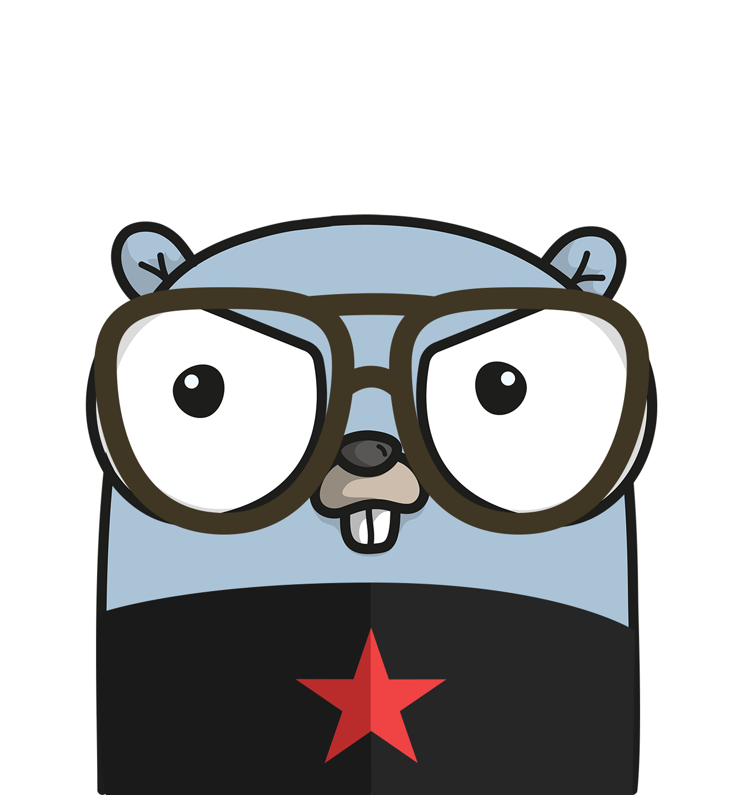
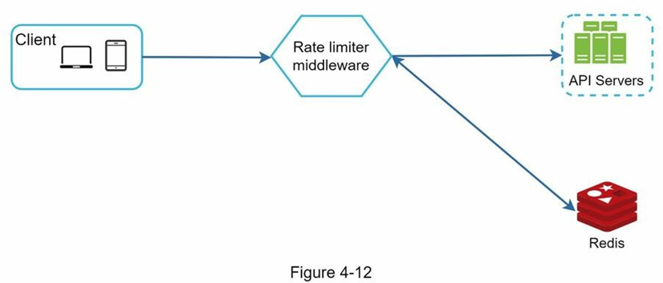

<h6 align="center">here is Mehran, start coding --</h6>

<p align="center">

</p>

# rate limiter
###### rate limiter in api-gateway using sliding-window algorithm


## Introduction
This is the entry of an api-server using rate limiter.
It's designed to control the rate of actions that can be performed by a user or a system.
The main goal is to prevent any part of the system from being overwhelmed by too many requests.

We use sliding-window algorithm to implement rate limiting. 
There is also a middleware that imposes a monthly quota on each user. 

The code structure is based on [project-layout](https://github.com/golang-standards/project-layout).
## Up and Running

first you should have docker installed in your system.
you can follow instruction on this [link](https://docs.docker.com/engine/install/).

after that build and run the project image running this command
```bash
docker compose up -d .  
```

## Getting started
first you need to signup:
```bash
curl --request POST \
  --url http://localhost:8080/signup \
  --header 'Content-Type: application/json' \
  --data '{
    "month_size_limit": 100, 
    "minute_rate_limit": 4
    }
```
you will see response like this:
```bash
{
	"ID": "d8fff3b4-388d-48f3-82c3-81924c0de5b4",
	"month_size_limit": 100,
	"minute_rate_limit": 4
}
```
you can do it by run bash script [here](https://github.com/arsalanaa44/rate_limiter/blob/main/script/signup_request.sh).

after that you can send your data as follows:
```bash
curl --request GET \
  --url http://localhost:8080/hello \
  --header 'Data-ID: id_sampleid' \
  --header 'Data-Size: 26' \
  --header 'User-ID: d8fff3b4-388d-48f3-82c3-81924c0de5b4' # id from signup respose
```
by passing the middlewares,
you will access to api which here is `HI`.
```bash
HI
```
you can see changes by run redis insight in your browser
```bash
http://localhost:8001/
```

## Design
before accessing the API-server we have some middlewares to pass.
<p align="center">

</p>


## Technology

### Handler
HTTP handler are defined in `handler` package. [Echo](https://github.com/labstack/echo)
is an awesome HTTP framework that has everything you need.

### Configuration
The main part of each application is its configuration. There are many ways for having configuration in the project from configuration file to environment variables.
[Koanf](https://github.com/knadh/koanf) has all of them in a one beautiful package. The main points here are:

- Having a defined and typed structure for configuration
- Don't use global configuration. each module has its configuration defined in `config` module and it will pass to it in its initiation.
- Print loaded configuration at startup, so everyone can validate the applied configuration.

### Logging
[zap](https://github.com/uber-go/zap) is one the best logger for structure logging.
`zap` forces you  name loggers with `Named` method.
By using the named logger you can easily find you module logs in your log aggregator.

### database
[redis](https://developer.redis.com/explore/what-is-redis/),
 which stands for Remote Dictionary Server, 
is known for its speed, reliability, and performance, delivering sub-millisecond response times and enabling millions of requests per second for real-time applications. 
so I decided to use it, reading [data types](https://redis.io/docs/data-types/) and found the best model to use.

### limiter algorithm
I searched for [different algorithms](https://medium.com/@SaiRahulAkarapu/rate-limiting-algorithms-using-redis-eb4427b47e33)
of rate limiter. the Sliding Window algorithm works by maintaining a sliding window of fixed duration which is best fit for our project. 
find this [page](https://mauricio.github.io/2021/12/30/rate-limiting-in-go.html) and use code from this [repo](https://github.com/mauricio/redis-rate-limiter).

### extra useful github resources and articles: 
[custom-rate-limiting-in-golang-using-redis-with-docker](https://medium.com/analytics-vidhya/custom-rate-limiting-in-golang-using-redis-with-docker-e4a7be96f7dc)<br>
[implementing-a-sliding-log-rate-limiter-with-redis-go](https://medium.com/circleslife/implementing-a-sliding-log-rate-limiter-with-redis-go-d59c6765db80)<br>
[rate-limiting-go-application](https://blog.logrocket.com/rate-limiting-go-application/#:~:text=Rate%20limiting%20is%20an%20essential,remains%20available%20to%20all%20users.)<br>
[tollbooth](https://github.com/didip/tollbooth)<br>


